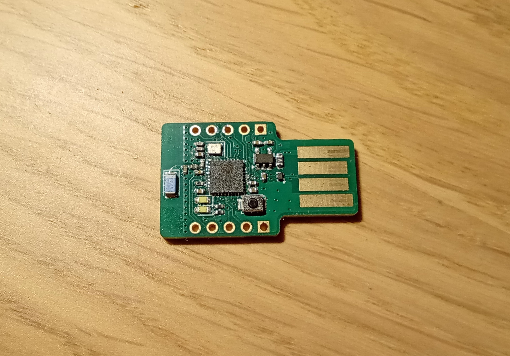
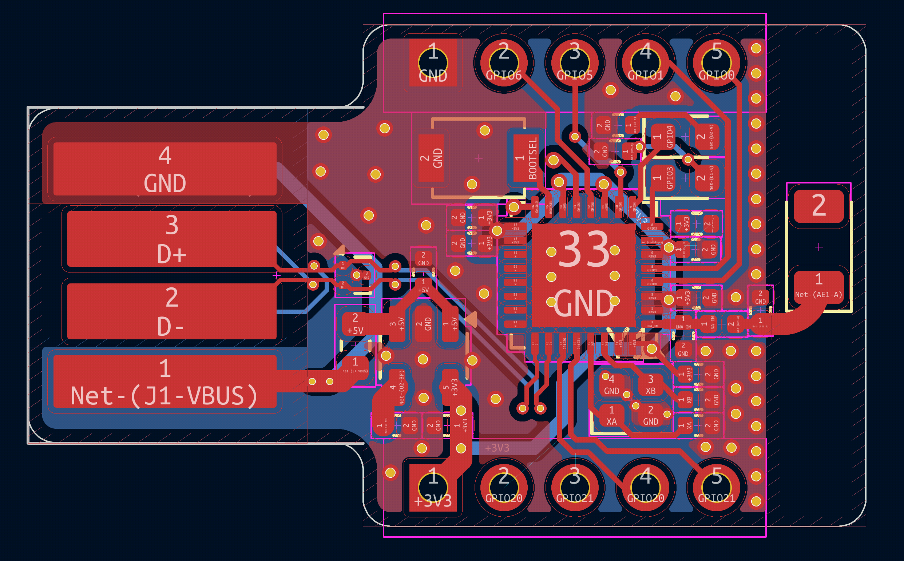

# ESP USB - ESP32 in your pockets

## Description

The tiny ESP32 development board that you can plug directly into your USB port.

- This board is tiny - enabling small projects. Has 8 GPIO pins, allowing diverse applications.
- It is portable - no external devices (except your laptop) are needed in order to program the chip! Have one of these in your pockets allowes you to create from anywhere.
- It is routed only using 2 layers, thus lowering per unit cost.
- It has a onboard 600mA voltage regulator

You can directly plug it into your USB port and program it, using your favourite IDE.

Features:
- Small 30x18mm footprint
- Portable - Plus & play
- Reliable - EING surface finish
- PCB USB receptacle - No cables needed
- 8 GPIOs - Do anything you want
- 2 user leds - Easy debugging
- Breadboard pinout

## Notes

If you need to supply 5v, solder a wire onto the usb pad.

This board needs to be 2.0mm thick in order to be sticked into a USB port.

### License

Licensed under Solderpad license, basically you can do anything but the board doesn't come with guarantee.

## This is not suited for production yet

I need to add some more decoupling caps & do more verification on the antenna
